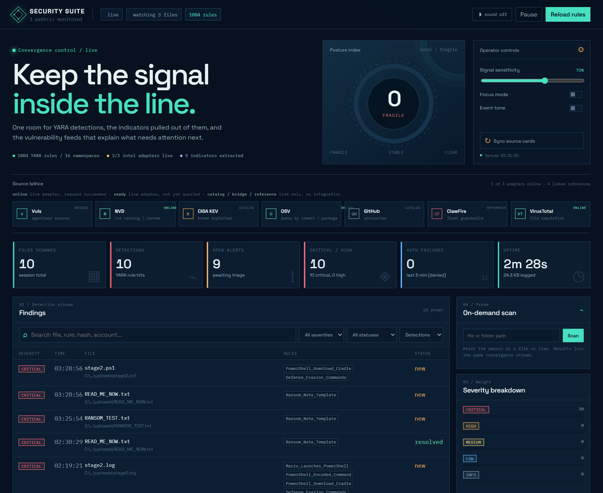
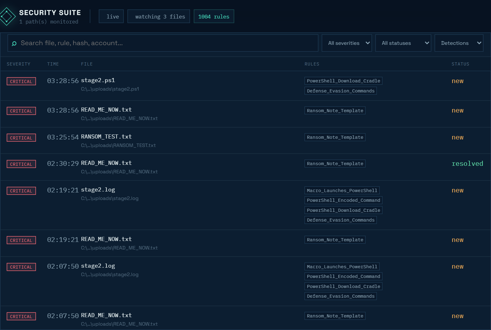
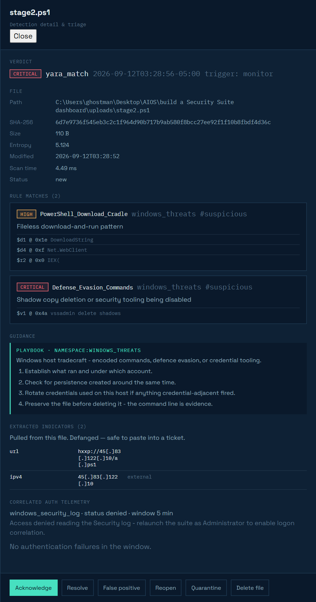
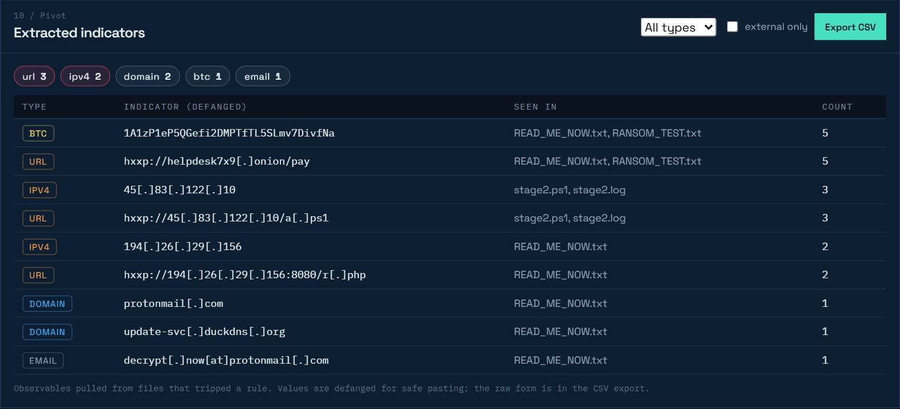
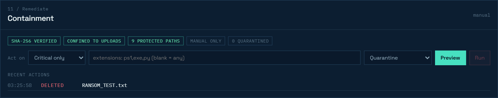

# Security Suite

A YARA-backed SOC detector with a live web dashboard, for Windows, macOS and
Linux. It watches directories, scans new files in memory against **1,004 rules**,
correlates hits against authentication telemetry from the same time window,
pulls the indicators back out of whatever it caught, and streams the lot to a
browser console in real time.

| | |
| --- | --- |
| **Detect** | 1,004 YARA rules across 16 namespaces — 73 hand-written, 931 generated from CISA KEV entries — web shells, ransomware, stealers, C2, macro droppers, Linux persistence, supply-chain hooks, RMM abuse |
| **Correlate** | Failed logons from the same window: Windows Security log, macOS unified log, or `auth.log`/journald |
| **Pivot** | URLs, domains, IPs, wallets, CVEs and paths extracted from every detection, defanged, with CSV export |
| **Enrich** | Live NVD, OSV and VirusTotal adapters — no credential needed for the first two |
| **Triage** | Acknowledge, resolve, mark false positive, in place and persisted |
| **Remediate** | Quarantine or delete a detected file, behind six safety rails, with CISA-sourced patch guidance |

One hard dependency (`yara-python`); the server is `http.server` from the
standard library and the dashboard is plain HTML/CSS/JS. Nothing to build.

Built from `YARA_scanning.py`, restructured into a service with a UI.

```bash
python run.py
```

Then open <http://127.0.0.1:8787> (it opens automatically).



---

## Requirements

| Package | Status | Needed for |
| --- | --- | --- |
| `yara-python` | **required** | the detection engine, every platform |
| `certifi` | recommended | a current CA bundle; without it NVD may fail TLS verification |
| `pywin32` | Windows only, optional | reading failed logons from the Security event log |

There is no web framework dependency: the server is `http.server` from the
standard library and the dashboard is plain HTML/CSS/JS. Nothing to build.
Python 3.10 or newer.

```bash
pip install -r requirements.txt   # only if you move this to another machine
```

---

## How to use it

Five minutes, start to finish.

### 1. Start it

```bash
python run.py
```

The console prints what loaded and what it can see — rule count, telemetry
source, whether auto-remediation is armed. The browser opens by itself.

### 2. Drop something in the watched folder

```bash
cp samples/README_RESTORE.txt uploads/     # macOS / Linux
copy samples\README_RESTORE.txt uploads\   # Windows
```

It appears in **Findings** within about two seconds, no refresh. The samples each
trip exactly one rule, so this is also the install check.



### 3. Read the finding

Click the row. The drawer gives you, in the order you need it: the verdict, the
file's identity (SHA-256, size, entropy), every rule that matched **with the
actual strings and their offsets**, the remediation guidance, the indicators
pulled out of the file, and any failed logons from the same time window.



Most triage decisions get made at the matched strings — which matters, because
opening suspicious files is how analysts become incidents.

### 4. Pivot on the indicators

The **Extracted indicators** panel aggregates observables across every
detection, ranked by how many distinct files they appear in — one address in
four unrelated uploads is a campaign; forty mentions in one dropper is a verbose
author. Everything is defanged, and **Export CSV** hands it to your SIEM.



### 5. Remediate, if you mean it



The badges are the current rails, read from the running system. Preview first —
it shows exactly what would be acted on and what the rails refuse — then Run,
which arms and asks again before doing anything.

---

## Remediation

**This is the one destructive part of the suite.** Everything else only reads.

| Action | Reversible? |
| --- | --- |
| `quarantine` | Yes — moved to `quarantine/` with its metadata |
| `restore` | Puts a quarantined file back |
| `delete` | **No.** `unlink`, gone |
| `purge` | **No.** Empties a file from quarantine |

### Six rails

A remediation only proceeds if all six pass; otherwise it is refused, with a
reason, and the refusal is recorded:

1. **Target comes from the finding**, never from a path in the request — the API
   is not an arbitrary-file-deletion primitive.
2. **SHA-256 re-verified** immediately before acting. Changed since detection?
   Refused — it is no longer the file that was detected.
3. **Confined** to your watch paths, compared after `realpath` so a symlink
   cannot walk out.
4. **Directories refused** unless explicitly requested.
5. **Dry run** reports the whole decision without touching anything.
6. **Suite-owned paths are never remediable** — the package, `rules/`, `book/`,
   `data/`, the quarantine, and every loose file in the project root.

Rail 6 exists because of a measurement. Pointed at this repository, the ruleset
flags 27 of 55 tracked files, **16 of them critical** — including the detector's
own rule files. An earlier version of the rail listed protected directories
instead of protecting the tree, and a test deleted `README.md`. Enumerating what
to protect produces a list that is never complete.

> **With 1,004 rules — 931 generated and never run against your data — expect
> false positives.** One rule in this repo raised *critical* on a Sunday school
> reading list containing the word *Exodus*. Prefer `quarantine` until you trust
> a rule; `delete` cannot be undone.

### Automatic remediation

Off by default. When enabled it defaults to **quarantine**, not delete, because
an unattended destructive action is a different risk from one you chose:

```json
{ "auto_remediate": true,
  "auto_remediate_severity": "critical",
  "auto_remediate_action": "quarantine" }
```

It announces itself at startup in terms that are hard to miss.

### Guidance

Every finding gets remediation guidance, and none of it is invented:

- **CVE findings** — CISA KEV's `cisaRequiredAction` quoted verbatim, with the
  due date and vendor patch links from NVD. All 931 generated rules carry a CVE.
- **Malware findings** — a playbook selected by the rule's *name* first, because
  `Ransom_Note_Template` lives in the `windows_threats` namespace and neither
  the namespace nor its `malware` tag says ransomware.

Deleting a file never remediates a CVE, so exposure findings say so and the
auto-rule excludes them.

```bash
curl -s "http://127.0.0.1:8787/api/remediate/guidance?id=<finding id>"
```

---

## Platform support

Runs on Windows, macOS and Linux. Detection is identical everywhere — it is
byte matching over files. What differs is where authentication telemetry comes
from, so each platform gets an ordered chain of providers and the dashboard
reports which one answered.

| | Windows | macOS | Linux |
| --- | --- | --- | --- |
| File monitoring, YARA, IOC extraction | yes | yes | yes |
| Dashboard, API, SSE | yes | yes | yes |
| Intel adapters (NVD / OSV / VirusTotal) | yes | yes | yes |
| Auth telemetry source | Security event log | unified log (`log show`) | `auth.log` / `secure`, else `journalctl` |
| Extra privilege for telemetry | Administrator | usually none | read access to the log or the `systemd-journal` group |
| Desktop launcher | `.lnk` | `.command` | `.desktop` |

There is no `/var/log/auth.log` on a modern macOS, and several Linux
distributions ship journald with no text auth log at all — so the chain tries
each source in turn and reports what it found:

```json
{ "platform": "linux", "source": "journald", "status": "ok",
  "attempts": [ {"provider": "auth_log",  "status": "unavailable"},
                {"provider": "journald",  "status": "ok"} ] }
```

If every provider fails the result is **never** reported as a successful empty
read. "No failed logons" and "nothing could read the logs" must not look the
same — that distinction is the whole point of the `status` field.

### Desktop launcher

```bash
python install_shortcut.py            # create one for this OS
python install_shortcut.py --remove   # take it away again
```

Writes a `.lnk` on Windows, a `.command` on macOS, and a `.desktop` entry on
Linux (both on the desktop and in the applications menu). Nothing is installed
system-wide and nothing needs elevation. Some Linux desktops require *Allow
Launching* from the file's context menu the first time.

---

## What it does

```
uploads/  ──▶  settle check  ──▶  YARA engine  ──▶  hit?  ──▶  auth telemetry
(watched)      (file stopped        (in-memory,              (last 5 min,
                changing)            73 rules)                real timestamps)
                                                                    │
                                        data/findings.ndjson  ◀─────┤
                                        SSE ──▶ dashboard     ◀─────┘
```

**Dashboard** (`http://127.0.0.1:8787`)

- Six live KPIs: files scanned, detections, open alerts, critical/high, auth failures, uptime
- Findings table with severity / status / type filters and full-text search
- Click any row for a detail drawer: SHA-256, size, entropy, every matched rule with
  the actual matched strings and their file offsets, plus the correlated logon failures
- Triage in place — acknowledge, resolve, mark false positive, reopen (persisted to `data/triage.json`)
- 60-minute detection activity chart, severity breakdown, top rules, live event feed
- On-demand scan of any file or directory tree
- Pause/resume the monitor and hot-reload rules without restarting
- Convergence source lattice linking Vuls, NVD, CISA KEV, OSV, GitHub Advisories,
  ClawFire, and an optional server-side VirusTotal adapter
- Posture dial, source health cards, focus mode, operator sensitivity control,
  and an opt-in Web Audio alert tone for new detections
- Extracted-indicator panel: observables pulled from every detected file,
  defanged, ranked by how many files they appear in, with CSV export

---

## Layout

```
run.py                  launcher (python run.py)
config.json             optional; created only if you write one
securitysuite/
  config.py             defaults + config.json loading
  engine.py             YARA compile/reload, scan, SHA-256, entropy, severity
  telemetry.py          Windows Security log + Linux auth.log, time-windowed
  watcher.py            polling monitor with settle detection
  store.py              NDJSON store, in-memory index, SSE pub/sub, triage
  server.py             HTTP API + SSE + static files
  net.py                shared TLS context (certifi) + JSON helpers
  nvd.py                NVD CVE API 2.0 client + local cache
  osv.py                OSV.dev lookup by commit / package / purl
  virustotal.py         hash reputation + Enterprise capability probe
  ioc.py                observable extraction (defanged) from matched files
assets/securitysuite.ico  desktop shortcut icon
book/                   the field guide (pdf + docx)
nvds/                   NVD cache (contents gitignored)
rules/                  1,004 rules; each file is one YARA namespace
  c2_network.yar          beacons, reverse shells, DNS tunnelling
  credential_theft.yar    LSASS dumping, browser stores, keylogging
  cryptominer.yar         miner config, stratum pools, browser mining
  demo.yar                test keyword, EICAR, high-entropy PE
  info_stealer_rat.yar    commodity stealers and remote-access trojans
  linux_threats.yar       reverse shells, cron/systemd persistence,
                          LD_PRELOAD rootkits, container escape
  office_macro_malware.yar  auto-exec macros, droppers, obfuscated VBA
  phishing_social_engineering.yar  credential harvesting and lures
  ransomware.yar          family indicators and extortion artifacts
  recon_persistence.yar   discovery chains, scheduled tasks, WMI, LOLBins
  rmm_tunnel_abuse.yar    silent RMM installs, unattended passwords,
                          ngrok/cloudflared tunnels, RDP exposure
  supply_chain.yar        npm/pip install hooks, CI secret theft,
                          build-pipeline tampering
  web_fraud_skimmer.yar   card skimming and formjacking
  webshell.yar            PHP / ASPX / JSP backdoors
  windows_threats.yar     encoded PowerShell, download cradles, credential
                          dumpers, shadow-copy deletion, ransom notes
  generated/              931 vulnerable-component rules built from NVD;
                          regenerate with generate_rules.py, safe to delete
samples/                harmless text files that trip specific rules
uploads/                the watched folder (starts empty)
data/findings.ndjson    append-only alert log
data/triage.json        triage state
web/                    dashboard
```

---

## Try it

Start the suite, then copy a sample into the watched folder:

```bash
# Windows
copy samples\README_RESTORE.txt uploads\

# macOS / Linux
cp samples/README_RESTORE.txt uploads/
```

The row appears in the dashboard within about two seconds — no refresh — as a
**critical** `Ransom_Note_Template` hit. Each sample fires a different rule:

| Sample | Rule | Severity |
| --- | --- | --- |
| `README_RESTORE.txt` | Ransom_Note_Template | critical |
| `cleanup_commands.txt` | Defense_Evasion_Commands | critical |
| `dump_notes.txt` | Credential_Dumper_Indicators | critical |
| `task_setup.log` | PowerShell_Encoded_Command | high |
| `update_helper.txt` | PowerShell_Download_Cradle | high |
| `mail_body.txt` | Suspicious_Double_Extension | medium |
| `report_q3.txt` | *(nothing — clean scan)* | — |

> Windows Defender will quarantine a genuine `.php` webshell or a real PE sample
> before the scanner can read it. That is expected and handled: the file is
> recorded as "unavailable at scan time", not as an error. The samples above are
> plain text so they survive.

---

## CLI

```bash
python run.py                          # monitor + dashboard
python run.py --watch D:\ftp --watch E:\inbox        # Windows
python run.py --watch /srv/ftp --watch /var/spool/in   # macOS / Linux
python run.py --port 9000 --no-browser
python run.py --scan ~/Downloads       # one-shot scan, JSON to stdout, exit
python run.py --headless               # monitor only, no web server
python run.py --scan-existing          # also scan files already present at startup
```

---

## Writing rules

Drop any `.yar` / `.yara` file into `rules/` and hit **Reload rules** in the
dashboard. Severity is read from rule metadata, so rule authors set triage priority:

```yara
rule My_Detection : malware
{
    meta:
        description = "Shown in the dashboard drawer"
        severity    = "critical"     // critical | high | medium | low | info
    strings:
        $a = "indicator" nocase
    condition:
        $a
}
```

Without `meta.severity` the tag is used (`malware` → high, `suspicious` → medium,
`test` → info); with neither, the finding defaults to medium. Each file becomes its
own YARA namespace, so rule names only need to be unique within a file. A rule file
that fails to compile is reported by name in the Ruleset panel — the rest still load.

---

## Generated rules

`generate_rules.py` turns NVD's structured CPE data into vulnerable-component
rules — *is a known-exploited component present in this artifact?*

```bash
python generate_rules.py --limit 1000 --dry-run   # report the tally
python generate_rules.py --limit 1000             # write rules/generated/
```

The shipped set is 931 rules, every one derived from a **CISA KEV** entry: a
vulnerability confirmed to be exploited in the wild. Nothing is invented — each
rule's product, version and CVE come from NVD.

**The gate matters more than the count.** A candidate ships only if its product
name is distinctive, it has a concrete affected version, it compiles, and it
fires on none of a benign corpus built from this repository's own files:

```
Candidates    : 1000
Survived gate :  931
Rejected      :  54 product name too short
                  9 characters that do not survive matching
                  3 product name too generic
                  3 duplicate rule name
```

Severity reflects that these detect **exposure, not compromise**. A vulnerable
library is a review item, not an interrupt — KEV entries are `high`, everything
else `medium` or `low`. Labelling them critical would wreck the scale the
hand-written rules depend on.

Cost: compile time 79 ms → 537 ms (once, at startup or reload); per-file scan
time is unchanged at ~3 ms. Delete `rules/generated/` to opt out entirely.

---

## Vulnerability intelligence

Three of the seven lattice sources are live adapters that make real requests;
the rest are labelled links. A card only shows `online` once a request has
actually succeeded.

| Source | Credential | What it answers |
| --- | --- | --- |
| **NVD** | optional | Browse CVEs by id, keyword, or modification window. ~390,000 records. |
| **OSV** | none | "Is *this* artifact vulnerable?" — query by commit, package, or purl. |
| **VirusTotal** | required | Hash reputation. Hunting is Enterprise-only — see below. |

```bash
# Sync the trailing 3 days of CVEs into ./nvds
curl -s -X POST http://127.0.0.1:8787/api/nvd/sync \
     -H "Content-Type: application/json" -d '{"days": 3}'

# Is a source commit affected by anything known?
curl -s -X POST http://127.0.0.1:8787/api/osv/query \
     -H "Content-Type: application/json" \
     -d '{"commit": "6879efc2c1596d11a6a6ad296f80063b558d5e0f"}'

# One CVE
curl -s "http://127.0.0.1:8787/api/nvd/cve?id=CVE-2021-44228"
```

NVD works with no key at 5 requests per 30 s; a free key raises that to 50.
OSV needs no credential at all. VirusTotal does no work without one.

### VirusTotal tiers, and what Hunting needs

VT Hunting — **Livehunt**, **Retrohunt** and **VTDIFF** — runs YARA across
VirusTotal's own stream and 600 TB historical corpus. All three are **Enterprise
features**. On the public API tier every Hunting and Intelligence endpoint
returns `403 ForbiddenError`, so the adapter probes the key on startup and
reports what it found rather than shipping panels that cannot work:

```bash
curl -s http://127.0.0.1:8787/api/vt/capabilities
```

```json
{ "tier": "public",
  "allowed": { "file_lookup": true, "livehunt": false,
               "retrohunt": false, "intelligence_search": false },
  "detail": "Public API tier: hash lookups only. Livehunt, Retrohunt, VTDIFF
             and Intelligence search require a VT Enterprise account." }
```

`/api/vt/livehunt` and `/api/vt/retrohunt` return **402** with that explanation
on a public key, and start working by themselves if the key is later upgraded —
the gate is a live capability probe, not a hardcoded assumption.

What the public tier *does* give you is the useful half for this tool: turning a
local YARA hit into a second opinion from ~75 engines.

```bash
curl -s "http://127.0.0.1:8787/api/vt/file?hash=<sha256 from a finding>"
```

Public tier allows 4 requests/minute and 500/day, so lookups are rate limited to
match and cached by hash. Enrichment is deliberately **on demand** rather than
automatic on every scan — a busy watched directory would exhaust the daily quota
in minutes.

> **This client never uploads files.** Submitting a file to VirusTotal publishes
> it, and other users can download it. Auto-submitting whatever lands in a
> watched folder would leak customer data and credentials in config files.
> Hashes only; uploading stays a human decision in the VT web interface.

### Credentials

Copy `.env.example` to `.env` and fill in what you have. `.env` is gitignored,
credentials are stripped from `config.json` on save, and no endpoint ever
returns a key — `/api/intel` reports only whether one is *configured* and
whether it *works*.

```
VIRUSTOTAL_API_KEY=      # required for the VirusTotal card
NVD_API_KEY=             # optional; only raises the rate limit
```

### A note on TLS

Python on Windows often has no CA file of its own (`ssl.get_default_verify_paths()`
returns `cafile: None`) and fails to verify `services.nvd.nist.gov` with a
misleading `certificate has expired`. The server certificate is fine — the local
trust store is not. `securitysuite/net.py` carries `certifi`'s bundle instead.
Verification is never disabled.

---


## The book

`book/Detection-Engineering-in-Practice.{pdf,docx}` is a field guide to SOC
detection engineering that uses this repository as its running case study.
Thirteen chapters and four appendices covering YARA rule design, the race
conditions in the file watcher, telemetry correlation, triage economics, the
intel adapters, indicator extraction, and remediation — including the bugs
found while building it, one of which deleted this README. **Fifth edition, 92 pages / ~24,600 words.**

Chapter 9 works through a real false positive end to end: scanning the book's
own manuscript tripped twelve rules, eleven correctly (it quotes IOC strings)
and one because a Sunday school reading list contains the word *Exodus*.

---

## Extracted indicators

A YARA match tells you a file is bad. It does not tell you what to hunt for
next — and the C2 address, exfil domain, and ransom wallet are usually sitting
in the same bytes. Every file that trips a rule is mined for observables:

| Category | Types |
| --- | --- |
| Network | URLs, domains, IPv4, `.onion` |
| Financial | Bitcoin, Ethereum, Monero |
| Contact | Email addresses |
| Host | Registry keys, Windows paths |
| Reference | CVE ids, embedded MD5 / SHA-256 |

```bash
# Everything, ranked by how many distinct files it appears in
curl -s http://127.0.0.1:8787/api/iocs | jq '.indicators[] | {type, defanged, file_count}'

# External addresses only
curl -s "http://127.0.0.1:8787/api/iocs?scope=external&type=ipv4"

# Hand it to the SIEM
curl -s "http://127.0.0.1:8787/api/iocs?format=csv" -o iocs.csv
```

**Everything is defanged on output** — `hxxp://185[.]220[.]101[.]47/gate[.]php`.
Indicators get pasted into tickets and chat clients that auto-link URLs, and a
live C2 link in an incident ticket eventually gets clicked. The raw value is
kept alongside and both appear in the CSV.

Extraction runs only on files that matched a rule; a clean scan's observables
are not interesting and thirteen regexes over every file would dominate the
scan budget. Private and loopback addresses are kept and labelled rather than
dropped — `10.0.0.5` in a lateral movement script is the finding.

---

## Configuration

Defaults live in `securitysuite/config.py`. To override, create `config.json` in
this folder with only the keys you want to change:

```json
{
  "watch_paths": ["C:\\inetpub\\uploads", "D:\\ftp\\incoming"],
  "lookback_minutes": 10,
  "poll_interval": 1.0,
  "max_file_mb": 128,
  "port": 8787
}
```

| Key | Default | Meaning |
| --- | --- | --- |
| `watch_paths` | `["uploads"]` | directories to monitor |
| `recursive` | `true` | include subdirectories |
| `poll_interval` | `2.0` | seconds between sweeps |
| `settle_seconds` | `1.0` | a file must stop changing this long before it is scanned |
| `max_file_mb` | `64` | files above this are skipped, not scanned |
| `lookback_minutes` | `5` | telemetry correlation window |
| `auth_log_path` | `/var/log/auth.log` | Linux/macOS only |
| `host` / `port` | `127.0.0.1` / `8787` | dashboard bind address |

---

## API

All endpoints are localhost-only and reject requests whose `Host` header is not a
loopback name (DNS-rebinding guard).

| Method | Endpoint | Purpose |
| --- | --- | --- |
| GET | `/api/state` | stats, monitor status, engine info, telemetry, config |
| GET | `/api/findings?severity=&status=&type=&q=&limit=` | filtered findings |
| GET | `/api/rules` | loaded rules and any compile errors |
| GET | `/api/telemetry?force=1` | recent auth failures |
| GET | `/api/intel` | source lattice health (no credential is ever returned) |
| GET | `/api/nvd` | NVD cache status: records cached, window, rate limit, TLS bundle |
| GET | `/api/nvd/cves?limit=&severity=` | cached CVEs, highest CVSS first |
| GET | `/api/nvd/cve?id=CVE-...` | one CVE, cached on disk after first fetch |
| GET | `/api/nvd/search?q=&limit=` | live keyword search against the NVD API |
| POST | `/api/nvd/sync` | `{"days": 3}` — sync the trailing window into the cache |
| GET&nbsp;/&nbsp;POST | `/api/osv/query` | lookup by `commit`, `purl`, or `package`+`ecosystem`+`version` |
| GET | `/api/osv` | OSV adapter status |
| GET | `/api/vt` | VirusTotal adapter status and detected tier |
| GET | `/api/vt/capabilities` | what the key may actually reach (probed, cached) |
| GET | `/api/vt/file?hash=` | hash reputation: engine verdicts, family label, permalink |
| GET | `/api/vt/livehunt` `…/retrohunt` | Enterprise-gated; returns 402 with the reason on public tier |
| GET | `/api/stream` | Server-Sent Events: `hello`, `event`, `stats` |
| POST | `/api/scan` | `{"path": "..."}` — scan a file or tree |
| POST | `/api/monitor` | `{"action": "pause"\|"resume"}` |
| POST | `/api/rules/reload` | recompile the ruleset |
| POST | `/api/triage` | `{"id": "...", "status": "...", "note": "..."}` |

`findings.ndjson` stays newline-delimited JSON, one alert per line, so it pipes
straight into a SIEM:

```bash
type data\findings.ndjson | jq -c "select(.severity==\"critical\")"
```

Clean scans are **not** written to disk — they are in-memory only, so the file
remains an alert log rather than an audit trail of every file ever seen.

### External intelligence

The dashboard keeps the scanner local and treats external sources as adapters.
The source lattice links to the Vuls project, NVD, CISA's Known Exploited
Vulnerabilities catalog, OSV, GitHub Advisories, and ClawFire fleet guardrails.
VirusTotal is optional and is checked server-side from `/api/intel` when a key is
available. Put the key in the process environment or a local, ignored `.env`:

```text
VIRUSTOTAL_API_KEY=your-key-here
```

The key is never sent to the browser or included in `/api/state` responses.

---

## What changed from `YARA_scanning.py`

| Original | Now |
| --- | --- |
| `get_recent_auth_events()` stamped every line with `datetime.now()` and returned the last 5 regardless of age — nothing was actually time-filtered | Each source parses its own timestamps; only events inside the window are returned. Syslog's missing year is inferred with rollover handling |
| Linux-only (`/var/log/auth.log`) | Windows Security event log (4625/4648/4740/4771/4776) with a graceful "run as Administrator" message, plus the Linux path |
| New files scanned the instant they appeared, so a large upload was scanned half-written | A file must stop changing for `settle_seconds` before it is scanned — verified by test: a file written in two pieces is scanned once, after the second write |
| `os.listdir` on one directory, non-recursive | Recursive walk with size/mtime change detection, so modified files are rescanned |
| Deleted files stayed in `seen_files` forever | Disappearing files are forgotten, so a re-upload is scanned again |
| Rule compile failure silently fell back to a dummy rule | Each rule file is validated individually; failures are surfaced by name in the UI, working rules still load |
| `matches` recorded as `[str(m)]` — just rule names | Rule, namespace, tags, metadata, severity, and each matched string with its file offset |
| No file identity | SHA-256, size, mtime, and Shannon entropy (flags packed/encrypted content) |
| Alert on a file bigger than RAM would try anyway | `max_file_mb` cap, files above it recorded as skipped |
| Scanned its own `findings.ndjson` if it sat in the watched folder — every alert re-alerting forever | The monitor excludes its own output files |
| `KeyboardInterrupt` caught inside the loop, `while True` with no way to pause | Clean shutdown, plus pause/resume and rule hot-reload from the UI |
| Output: one print line and a log file | Live dashboard with triage workflow, filters, charts, and a JSON API |

The original file is unchanged; nothing here overwrites it.

---

## Notes

- **Run as Administrator** to enable logon correlation on Windows. Without it the
  dashboard shows `denied` with an explanation and detection still works fully —
  only the telemetry panel is empty.
- The server binds `127.0.0.1` and has no authentication. It is a local console;
  do not bind it to `0.0.0.0` on an untrusted network.
- `POST /api/scan` will read any path the running user can read. That is the point
  of an on-demand scanner, but it is also why the listener stays on loopback.
- Remediation is **destructive and manual by default**. Nothing is moved or
  deleted unless you act on a specific finding, or you explicitly enable the
  auto-rule. See [Remediation](#remediation).
