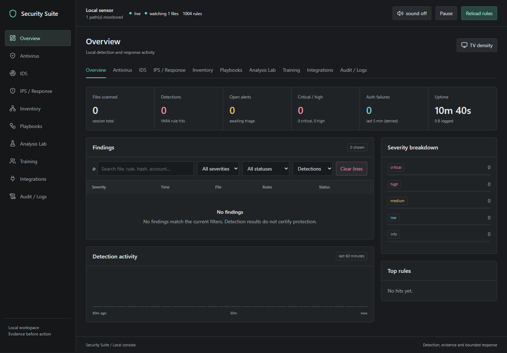
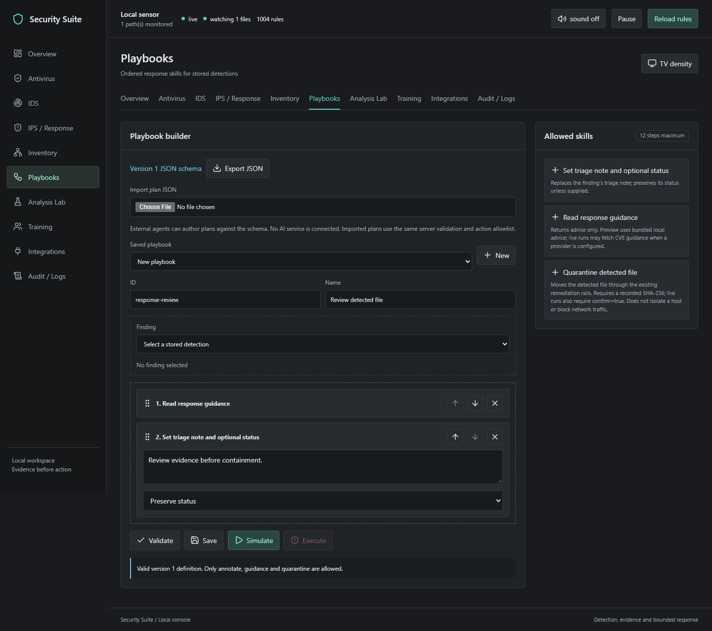

# Security Suite Console Release

Version: 1.1.0. Release date: 2026-09-16

The console uses separate sidebar tabs for overview, antivirus, IDS, response,
inventory, playbooks, analysis, training, integrations and audit. It keeps the existing
YARA rules, IOC extraction, NVD guidance, triage, quarantine and restoration.

## Added

- Streaming background local-drive scans with no 5,000-file cap, progress,
  skipped/error reporting and cooperative cancellation.
- Private IPv4 household inventory with bounded ping and optional TCP checks;
  device records and CSV export.
- Suricata EVE alert import and a verified, read-only OPNsense IDS status adapter.
- Visual schema-backed playbooks with JSON interchange, simulation, guarded
  execution, and a fixed defensive skill catalog.
- Static text analysis that does not execute or persist submitted content.
- 500 synthetic defensive training questions and local two-player scoring.
- Persistent recoverable auto-quarantine control and reviewed DNS-list export.
- Offline Lucide icons, responsive workspace views and large-screen density.
- Repository security policy, Dependabot configuration, CodeQL workflow, and
  Windows/Linux/macOS test matrix.

## Fixed

- Clear-lines requests now include the server-required confirmation.
- Scan counters continue beyond the bounded findings buffer.
- The monitor no longer shadows the Thread stop method.
- Automatic response rejects deletion, test-rule hits and generated component hits.
- API request validation rejects malformed JSON, duplicate fields, non-boolean
  confirmations and cross-origin writes; the server remains bound to loopback.
- Workbench state is protected from remediation and excluded from drive-scan feedback.
- Quiet Windows shortcuts use an absolute script path. Repeated launches reuse
  the same-version workspace, and default-port collisions have a bounded fallback.

## Pictures and Use

Start with Antivirus for a local drive scan, IDS for imported network alerts,
and Inventory for a private subnet you administer. Use Playbooks to select a
stored finding, arrange allowed skills, validate, simulate, then confirm execution.
IPS / Response keeps quarantine and reviewed DNS exports separate from deletion.
Audit shows recorded activity. See the guide for skip counts and safety checks.

## Scope

Security Suite supplements an installed antivirus. It has no NSA affiliation or
certification, kernel driver, online multiplayer service or malware execution VM.
Inventory does not scan other computers' files or determine firmware safety.
OPNsense status does not prove inline network blocking. Bitdefender setup remains
an offline indicator, and domain-list export requires a DNS filter for enforcement.
No live malware, offensive payloads or hack-back features are included.

See the [operator guide](../book/Security-Suite-Operator-Guide.md) and
[security policy](../SECURITY.md) for use and deployment boundaries.
