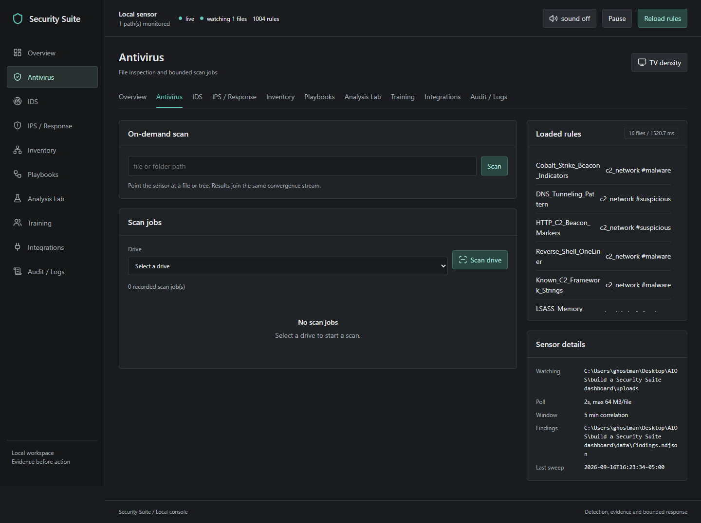

# Security Suite 1.1.0 Update Report

Written: 2026-09-16.
Program baseline: [commit 2f80cfe](https://github.com/gocar112/security-suite-dashboard/commit/2f80cfe).

## Overview

This update turns the existing dashboard into a tabbed defensive workbench.
It brings local scanning, findings, network observations, containment, visual
response plans, and training into one interface. The program retains its
1,004-rule YARA library, indicator extraction, NVD/OSV context, optional
VirusTotal hash lookups, and guarded remediation.

A rule match is evidence to investigate, not proof of infection. Some rules
detect vulnerable-component strings or suspicious behavior rather than malware.
The suite supplements installed antivirus protection; it is not an NSA product
and does not claim complete protection.


## What Changed

| Tab | Purpose |
| --- | --- |
| Overview | Findings, severity totals, detection activity and indicator pivots. |
| Antivirus | File/folder scans, background local-drive jobs and a Windows antivirus registration check. |
| IDS | Import and review Suricata EVE network alerts and authentication telemetry. |
| IPS / Response | Guarded quarantine, restoration, manual deletion, response policy and reviewed DNS exports. |
| Inventory | Discover devices on a selected private IPv4 subnet and export observations as CSV. |
| Playbooks | Arrange allowed response skills without writing scripts; validate, simulate, save and execute plans. |
| Analysis Lab | Match pasted text against YARA and extract indicators without running the content. |
| Training | Play 500 synthetic defensive scenarios with two people sharing the browser. |
| Integrations | Review connector setup and explicitly check an OPNsense IDS service. |
| Audit / Logs | Review recorded activity and recent remediation attempts. |

The layout supports phone, tablet, desktop and large-screen viewing. Icons are
bundled locally, and a TV-density setting enlarges controls. The full rules list
scrolls within its panel rather than stretching the page.

### Scanning and Inventory

Drive scans now run as background jobs with progress, match counts, skipped
entries, errors and cancellation. Traversal streams files instead of building
a large in-memory list, and the previous 5,000-file cap is removed. One job
can be active at a time. Cancellation waits for the current scan or operating
system call to finish.

The default file-size limit remains 64 MB. Permissions, links/junctions,
special files, Linux pseudo-filesystems, quarantine and suite-generated state
can prevent or exclude inspection. A completed job does not mean every byte
on the drive was inspected; review its skips and errors.

Inventory accepts an explicit RFC1918 IPv4 subnet, /24 through /32. Discovery
uses bounded neighbor-cache and ping checks. Optional service checks connect
to eight selected TCP ports without sending application data. Port labels do
not identify a product or prove a device is safe. Discovery does not inspect
another computer's files, exploit devices, or scan TV/IoT firmware.



### Visual Response Plans

Playbooks use the checked-in [version 1 JSON schema](../web/playbook.schema.json).
The allowed skills are annotation, guidance and quarantine, with at most
12 steps. Skills can be selected or dragged into a sequence and reordered.
Plans can be saved locally or exchanged as JSON with external coding agents.
No AI service is connected by this update, and imported plans cannot introduce
arbitrary JavaScript, PowerShell, Python or shell execution.

Simulation does not change triage, move files, or perform external guidance
lookups. The interface requires a fresh simulation after edits before execution.
The server separately validates the plan and the stored finding. Live quarantine
requires confirmation and the existing path, identity and hash checks. Execution
stops on failure; successful earlier steps are not rolled back.


### Safer Automatic Response

Automatic response is opt-in and limited to recoverable quarantine. An eligible
rule must explicitly carry `confidence = "high"` and meet the configured
severity threshold. A stored finding, an unchanged recorded SHA-256 and an
allowed remediation root are also required. Test rules and generated
vulnerable-component rules cannot authorize automatic response. Shipped
heuristics are not automatically promoted to high confidence.

Deletion remains manual. Scanning an entire drive does not expand the permitted
remediation roots. Attempts and refusals are recorded for review.

### Integrations and Practice

Suricata EVE import accepts up to 100 records / 48 KB and validates the batch
before storage. Only alert records are imported. Untrusted imported paths and
hashes cannot become local file-remediation targets.

The OPNsense adapter performs an explicit, read-only IDS status request over
verified HTTPS. A running service is not proof that inline IPS blocking is
enabled. Bitdefender remains an offline setup indicator, not a functioning
GravityZone control API. Reviewed domains can be exported as hosts entries;
saving or exporting them does not enforce ad or spyware blocking.

The Analysis Lab is static text analysis, not a malware-execution sandbox.
Training is local pass-and-play with synthetic questions, not 500 reproduced
attacks or antivirus efficacy tests. Neither feature executes offensive payloads.

## How to Use the Update

1. Install dependencies with `pip install -r requirements.txt`, then run
   `python run.py`. Use the console URL reported by the launcher. The default
   is `http://127.0.0.1:8787`; a busy default port has a bounded fallback.
2. In Antivirus, select a drive or enter a file/folder path. Start the scan,
   review progress, and inspect skips and errors when it finishes.
3. Open a finding in Overview. Review rule metadata, file identity, matched
   strings and extracted indicators before deciding what to do.
4. In Playbooks, select the stored detection, add guidance or annotation,
   fill any required note, then Validate and Simulate. Review the result before
   Execute. Add quarantine only when the evidence warrants containment.
5. In Inventory, enter a private subnet you administer, such as
   `192.168.1.0/24`. Choose discovery or optional service checks, then export
   the observed device inventory if needed.
6. Import exported sensor alerts through IDS. Configure an external gateway
   or sensor separately when live network prevention is required.
7. Review Audit / Logs after response actions. Keep installed antivirus enabled
   and deploy a local scanner on each computer whose files need inspection.

To recreate the desktop launcher:

```powershell
python install_shortcut.py
```

To enable per-user sign-in startup:

```powershell
python install_shortcut.py --startup
```

Windows shortcuts use `pythonw.exe` when available and an absolute script path,
so launching the suite does not open a PowerShell console. Repeated launches
reuse only the same-version console for the same workspace. Startup does not
itself enable automatic quarantine.

## Verification Record

The program baseline was checked locally on Windows with Python 3.14.

| Check | Result |
| --- | --- |
| Automated regression suite | 55 tests passed. |
| CI smoke script | Passed with harmless fixtures. |
| Python compilation and JavaScript syntax | Passed. |
| Browser layout | All ten tabs passed checks at 390, 768, 1440 and 1920 pixels. |
| Browser interactions | Static analysis, playbook validation, two-player training and TV density passed. |
| Scan behavior | Regression coverage includes streaming 5,001 generated files and cooperative cancellation. |
| Response safeguards | Tests cover high-confidence opt-in, stored hashes, protected paths and automatic-deletion refusal. |
| API boundaries | Tests cover malformed JSON, confirmations, cross-origin writes and local binding. |
| Desktop/startup launchers | Windows shortcuts verified against the hidden launcher and absolute script path. |
| Hosted CI | Not executed: GitHub reported an account-level startup restriction. Rerun after resolving it. |

Windows/Linux/macOS CI and Python/JavaScript CodeQL workflows are committed.
Their presence is not a passing hosted result. No live malware was downloaded,
no household network sweep was performed during verification, and these checks
do not establish real-world detection accuracy or cross-platform certification.

## Repository and Operational Notes

The update includes [SECURITY.md](../SECURITY.md), weekly Dependabot
configuration and CodeQL analysis. Administrators still need to verify the
repository's security settings separately. Local `.env` values, runtime logs,
device observations and quarantine payloads are excluded from commits.

Keep credentials local, rotate exposed keys, review vendor patch guidance
before applying updates, and investigate false positives before enabling
automatic response. Vulnerability guidance is advice, not automatic patch
deployment. There are no hack-back capabilities or guarantees of universal
protection.

For detailed operations, see the [operator guide](../book/Security-Suite-Operator-Guide.md).
For a shorter overview, see the [release summary](release-summary.md).
